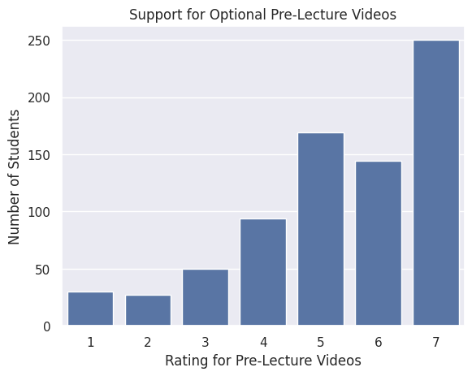
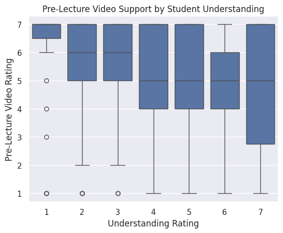
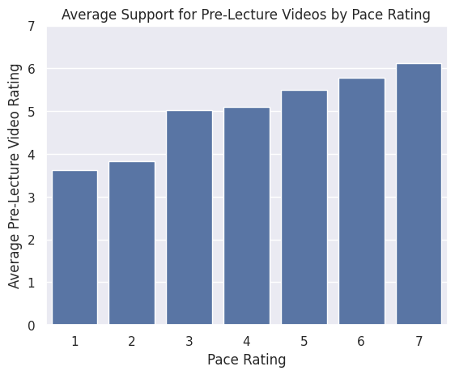

---
# Do not edit the text between these lines!
layout: default
---

# COMP110 Final Project: Improving Learning with Pre-Lecture Videos

## Summary

In this project, I analyzed survey data from COMP110 students to explore ways the course could be improved.

My main idea was to introduce optional pre-lecture videos to help students prepare before lectures. These videos would allow students to understand key concepts ahead of time and follow lectures more easily.

To test this idea, I analyzed survey data related to:
- Interest in pre-lecture videos
- Student understanding of course material
- Course difficulty
- Whether students would recommend the course

I used Python and seaborn to create visualizations and analyze patterns in the data.

## Data Visualizations

### Interest in Pre-Lecture Videos
This chart shows that many students rated pre-lecture videos highly, suggesting strong demand for them.

### Understanding vs Interest in Pre-Lecture Videos
This chart suggests that students who feel less confident in their understanding are more likely to want pre-lecture videos.

### Difficulty vs Recommendation
This chart shows that students who find the course more difficult are less likely to recommend it.

## Conclusion

The analysis supports the idea that pre-lecture videos could improve the learning experience in COMP110.

Many students showed strong interest in pre-lecture videos, especially those who struggle more with understanding the material. This suggests that adding pre-lecture videos could help students feel more prepared and improve their overall experience.

However, there are some trade-offs. Creating videos requires time and effort, and some students might rely too heavily on them instead of engaging in lectures.

In the future, more data could be collected to measure how pre-lecture videos directly impact student performance.

Overall, pre-lecture videos are a realistic and valuable way to improve the course.